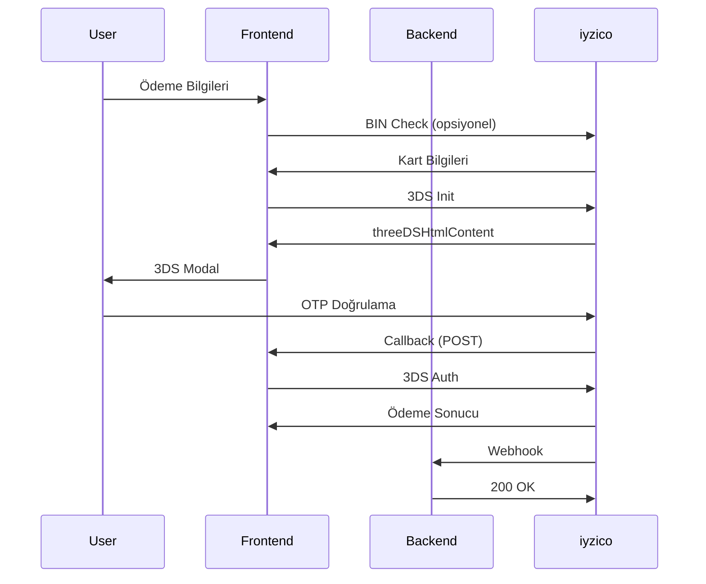

# iyzico 3DS Ödeme Entegrasyonu

Bu proje, iyzico dokümantasyonuna uygun olarak tam 3DS ödeme akışını uygular.

## 📋 Özellikler

### ✅ Tamamlanan Adımlar

1. **BIN Check** - Kart doğrulama ve taksit bilgileri
2. **3DS Başlatma** - Ödeme sürecini başlatma
3. **threeDSHtmlContent Decode** - 3DS sayfasını gösterme
4. **Yönlendirme** - Callback URL işleme
5. **3DS Tamamlama** - Ödeme doğrulama
6. **Webhook** - Gerçek zamanlı bildirimler

### 🏗️ Mimari

```
├── pages/payment/
│   ├── test.vue                    # Test sayfası (kullanıcı arayüzü)
│   └── callback/[slug].vue        # Callback URL handler
├── composables/
│   └── useIyzicoPayment.ts        # iyzico API işlemleri
└── server/api/webhook/
    └── iyzico.post.ts             # Webhook handler
```

## 🚀 Kullanım

### 1. Test Sayfası

`/payment/test` sayfasında:

- Kart bilgilerini girin
- BIN check yapın (opsiyonel)
- 3DS ödeme başlatın
- Modal'da 3DS doğrulamasını tamamlayın

### 2. Entegrasyon

```vue
<script setup>
const { processPayment } = useIyzicoPayment();

const result = await processPayment({
  card: {
    cardHolderName: "John Doe",
    cardNumber: "5526080000000006",
    expireMonth: "11",
    expireYear: "2030",
    cvc: "200"
  },
  amount: "100.00",
  buyer: { /* buyer bilgileri */ },
  basketItems: [ /* sepet öğeleri */ ]
});

if (result.success) {
  // 3DS HTML'ini modal'da göster
  showModal(result.data.threeDSHtml);
}
</script>
```

## 🔧 Konfigürasyon

### Environment Variables

```env
MEDUSA_URL=https://your-medusa-backend.com
MEDUSA_PUBLISHABLE_KEY=your-publishable-key
```

### Callback URL

iyzico panelinde callback URL'i ayarlayın:
```
https://your-domain.com/payment/callback/result
```

### Webhook URL

iyzico panelinde webhook URL'i ayarlayın:
```
https://your-domain.com/api/webhook/iyzico
```

## 📊 Akış Diyagramı



## 🔍 Durum Kodları

### mdStatus Değerleri

| Kod | Açıklama |
|-----|----------|
| 1   | ✅ Başarılı 3DS doğrulama |
| 0   | ❌ 3DS imza hatası |
| 2   | ❌ Kart sisteme kayıtlı değil |
| 3   | ❌ Banka sisteme kayıtlı değil |
| 4   | ❌ Müşteri kayıt olmamayı seçmiş |
| 5   | ❌ Doğrulama yapılamıyor |
| 6   | ❌ 3DS sistem hatası |
| 7   | ❌ Genel sistem hatası |
| 8   | ❌ Bilinmeyen kart |

## 🛡️ Güvenlik

### Doğrulama Kontrolleri

1. **paymentId** eşleşmesi
2. **status** = "success" kontrolü
3. **mdStatus** = "1" kontrolü
4. **price** tutarı eşleşmesi
5. **conversationId** eşleşmesi

### Webhook Güvenliği

- IP kısıtlaması (iyzico IP'leri)
- Signature doğrulaması (gelecekte)
- Rate limiting
- Idempotency kontrolleri

## 🔧 Test Kartları

iyzico test kartları:

```javascript
// Başarılı Test Kartı
{
  cardNumber: "5526080000000006",
  expireMonth: "11",
  expireYear: "2030",
  cvc: "200"
}

// Başarısız Test Kartı
{
  cardNumber: "5406670000000009",
  expireMonth: "11", 
  expireYear: "2030",
  cvc: "200"
}
```

## 📝 Loglar

### Frontend Loglar

- Browser Console'da tüm API çağrıları
- 3DS akış adımları
- Hata detayları

### Backend Loglar

- Webhook alımları
- Ödeme doğrulamaları
- Hata durumları

## 🚨 Hata Yönetimi

### Yaygın Hatalar

1. **threeDSHtmlContent boş** - API bağlantı sorunu
2. **mdStatus != 1** - 3DS doğrulama başarısız
3. **paymentId mismatch** - Güvenlik ihlali
4. **Webhook timeout** - Sunucu yanıt vermiyor

### Hata Çözümleri

```typescript
try {
  const result = await processPayment(data);
} catch (error) {
  if (error.message.includes('mdStatus')) {
    // 3DS doğrulama hatası
    showError('3DS doğrulama başarısız');
  } else if (error.message.includes('paymentId')) {
    // Güvenlik hatası
    showError('Güvenlik doğrulaması başarısız');
  } else {
    // Genel hata
    showError('Ödeme işlemi başarısız');
  }
}
```

## 📚 Referanslar

- [iyzico 3DS Dokümantasyonu](https://docs.iyzico.com/odeme-metotlari/3ds/3ds-entegrasyonu)
- [iyzico API Referansı](https://docs.iyzico.com/api)
- [Test Ortamı](https://sandbox-api.iyzipay.com)

## 🔄 Güncelleme Notları

### v1.0.0
- ✅ Tam 3DS akışı
- ✅ BIN check entegrasyonu
- ✅ Webhook handler
- ✅ Composable yapısı
- ✅ Error handling
- ✅ TypeScript desteği

## 🤝 Katkıda Bulunma

1. Fork'layın
2. Feature branch oluşturun
3. Testlerinizi yazın
4. Pull request gönderin

## 📄 Lisans

MIT License